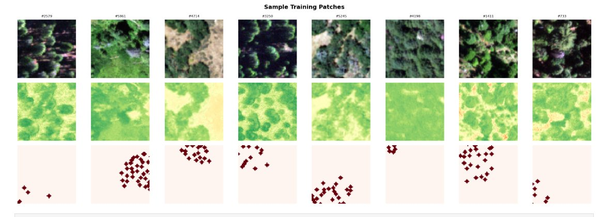

# ShrubMap Data Challenge

<h3 align="center">
  <span style="color:#2E75B6">High-Resolution Shrub Segmentation Pipeline</span>
  <span> for </span>
  <span style="color:#C00000">Wildfire Risk</span>
  <span> & </span>
  <span style="color:#2E7D32">Public Health</span>
</h3>

<p align="center">
  
  
  
  
</p>

<p align="center">
  <strong>Sami Bahig</strong> — AI Engineer &amp; ML Researcher, MD MSc<br/>
  Wildfire Science &amp; Technology Commons, University of California San Diego<br/>
  Shrubwise Data Challenge — Sprint 4 — April 2026<br/>
  <a href="https://github.com/samibahig/ShrubMap-Data-Challenge">github.com/samibahig/ShrubMap-Data-Challenge</a>
</p>

---

## Overview

ShrubMap is an end-to-end deep learning pipeline for high-resolution shrub segmentation from NAIP multispectral imagery across 6 ecologically diverse California sites. It integrates 12 complementary input channels (spectral indices + texture features) and achieves **IoU=0.8397** with a ResNet34-UNet architecture trained on 192×192 patches.

This pipeline is motivated by the public health consequences of wildfire smoke exposure. Accurate shrub maps yield better fuel load estimates, more precise PM2.5 projections, and ultimately more effective emergency preparedness for vulnerable communities.

**Best Performance (Sprint 4):**

| Model | IoU | F1 | Recall | Precision |
|---|---|---|---|---|
| ResNet34-UNet 192×192 run3 ★ | **0.8397** | 0.9055 | 0.9585 | 0.8579 |
| Ensemble 2×ResNet34 (run2+3) | 0.8320 | 0.9083 | 0.9607 | 0.8613 |

---

## Sample Training Patches (192×192)



*Top row: NAIP RGB. Middle row: NDVI channel. Bottom row: binary shrub mask (dark red = shrub pixels). 8 patches across Sedgwick Reserve training site.*

---

## Best Model — Training Curves (ResNet34-UNet 192×192 Run 3)


*Left: IoU, F1, and Precision per epoch. Right: Train vs Val loss. Best IoU=0.8397 at epoch 35 — stable val loss ~0.13, no overfitting.*

---

## Pipeline Architecture

```
NAIP 0.6m imagery (4 bands)
        ↓
Feature Engineering (12 channels)
R, G, B, NIR + NDVI, EVI, TGI, NDWI, Brightness, VARI, texture_var, texture_ent
        ↓
TLS LiDAR masks → reprojection EPSG:26910 → binary label maps (ground truth)
        ↓
Patch extraction 64×64 (stride=16, min_shrub=5%) → 6,566 patches
        ↓
Upsample 192×192 + normalization (p1–p99 per channel)
        ↓
Augmentation ×9 geometric (full ×8 advanced pipeline implemented, server-limited)
        ↓
ResNet34-UNet training (Dice+BCE, pos_weight=21, early stopping patience=15)
        ↓
Ensemble IoU-weighted soft voting
```

---

## Repository Structure

```
ShrubMap-Data-Challenge/
│
├── 01_data_preparation.ipynb      # Feature engineering, patch extraction, label alignment (6 sites)
├── 02_patch_preprocessing.ipynb   # Patch preprocessing, normalization, augmentation pipeline
├── 03_baseline_models.ipynb       # Random Forest, XGBoost, SVM baselines + SHAP analysis
├── 04_deep_learning.ipynb         # ResNet34/50-UNet 192×192 training, ensembles (Sprint 4)
│
├── task_als_tls.ipynb             # ALS/TLS LiDAR processing and shrub mask generation
├── tasks_3dep.ipynb               # 3DEP LiDAR data acquisition and CHM extraction
├── tasks_naip.ipynb               # NAIP imagery acquisition and preprocessing
├── tasks_rap.ipynb                # RAP (Rangeland Analysis Platform) data integration
├── task-shrub-list.ipynb          # Shrub list generation and IntELiMon workflow comparison
│
├── ShrubMap_Report_vf.pdf         # Final report addressing Questions 1–5
├── Dockerfile                     # Reproducible environment
├── requirements.txt               # Python dependencies
└── README.md                      # This file
```

---

## Study Sites

| Site | Biome | Masks | Split |
|---|---|---|---|
| Sedgwick Reserve | Oak savanna (300–500m) | 117 | Train |
| Calaveras Big Trees | Mixed conifer (1200–1500m) | 105 | Train |
| Independence Lake | Subalpine (2000m+) | 56 | Validation |
| DL Bliss | Riparian, Lake Tahoe | 27 | Test |
| Pacific Union College | Mediterranean coastal | 37 | Test |
| Shaver Lake | Mixed Sierra Nevada | 23 | Test |

**Total: 299 manually annotated TLS LiDAR masks**

---

## Environment Setup

### Option 1 — Docker (for local reproducibility)

```bash
git clone https://github.com/samibahig/ShrubMap-Data-Challenge.git
cd ShrubMap-Data-Challenge
docker build -t shrubmap .
docker run -p 8888:8888 -v $(pwd):/home/jovyan/work shrubmap
```

Then open `http://localhost:8888` and run the notebooks in order.

### Option 2 — pip

```bash
pip install -r requirements.txt
```

---

## How to Run

```bash
# Data acquisition
jupyter nbconvert --to notebook --execute tasks_naip.ipynb
jupyter nbconvert --to notebook --execute tasks_3dep.ipynb
jupyter nbconvert --to notebook --execute tasks_rap.ipynb
jupyter nbconvert --to notebook --execute task_als_tls.ipynb

# Shrub list generation
jupyter nbconvert --to notebook --execute task-shrub-list.ipynb

# Data preparation and preprocessing
jupyter nbconvert --to notebook --execute 01_data_preparation.ipynb
jupyter nbconvert --to notebook --execute 02_patch_preprocessing.ipynb

# Baseline models
jupyter nbconvert --to notebook --execute 03_baseline_models.ipynb

# Deep learning training (~2-4 hours with GPU)
jupyter nbconvert --to notebook --execute 04_deep_learning.ipynb
```

Or open each notebook and run **Kernel → Restart & Run All**.

---

## Key Results

| Model | IoU | F1 | Recall | Precision | Epochs |
|---|---|---|---|---|---|
| NDVI Threshold (baseline) | 0.185 | 0.312 | 0.760 | — | — |
| Random Forest 128×128 + SMOTE | 0.571 | 0.728 | 0.827 | 0.651 | — |
| EfficientNet-B3 UNet | 0.684 | 0.806 | 0.945 | — | 176 |
| UNet 128×128 | 0.751 | 0.858 | 0.954 | 0.779 | 163 |
| UNet-ResNet50 128×128 | 0.757 | 0.844 | 0.957 | — | 124 |
| **ResNet34-UNet 192×192 run3 ★** | **0.8397** | **0.9055** | **0.9585** | **0.8579** | **35** |
| Ensemble 2×ResNet34 (run2+3) | 0.8320 | 0.9083 | 0.9607 | 0.8613 | — |

**Literature benchmark surpassed:** Zhu et al. (2025) F1=0.789

---

## Feature Engineering — 12 Channels

| # | Channel | Description |
|---|---|---|
| 1–4 | R, G, B, NIR | Raw NAIP bands |
| 5 | NDVI | Vegetation vigor |
| 6 | EVI | Enhanced vegetation (reduces soil noise) |
| 7 | TGI | Triangular greenness index |
| 8 | NDWI | Water index (excludes water bodies) |
| 9 | Brightness | Overall reflectance |
| 10 | VARI | Visible atmospherically resistant index |
| 11 | texture_var | Local NDVI variance (5×5 window) |
| 12 | texture_ent | NIR Shannon entropy (disk radius 3) |

**SHAP analysis:** texture_ent (0.171) and texture_var (0.099) are the most discriminative features.


*Random Forest Feature Importance (12 channels). texture_ent dominates — surface complexity and roughness are the key shrub indicators.*


*Feature maps for Calaveras Big Trees site. Top row: NAIP RGB, NDVI, EVI, TGI. Bottom row: NDWI, Brightness, Texture Variance, Texture Entropy. TEXTURE_ENT shows the highest discriminative power.*

---

## Public Health Motivation

Shrub mapping is a public health problem. The causal chain:

```
Shrub cover density → surface fuel load (kg/m²)
        ↓
Fuel load × ignition probability → fire intensity
        ↓
Fire intensity → PM2.5 emissions
        ↓
PM2.5 exposure → cardiopulmonary morbidity & mortality
```

In California, wildfires account for 50% of total primary PM2.5 emissions. A 30% increase in emergency visits at Rady's Children's Hospital was documented for each 10-unit PM2.5 increase from wildfire smoke (San Diego County). Every false negative — every missed shrub patch — propagates directly to underestimated fire severity and inadequate public health preparedness. This is why we prioritize Recall over Precision.

---

## Green AI Commitment

- **Transfer learning** — ResNet34/50 ImageNet pretrained weights (60–80% compute reduction vs scratch)
- **Early stopping** — patience=15, no wasted epochs
- **Patch-based training** — memory-efficient, no full GeoTIFF processing
- **Future:** CodeCarbon/CarbonTracker integration for CO2e reporting per training run

---

## Pre-trained Model

Best model checkpoint available on request.  
Architecture: `segmentation_models_pytorch.Unet(encoder_name='resnet34', in_channels=12, classes=1)`

---

## License

MIT License — see LICENSE for details.
